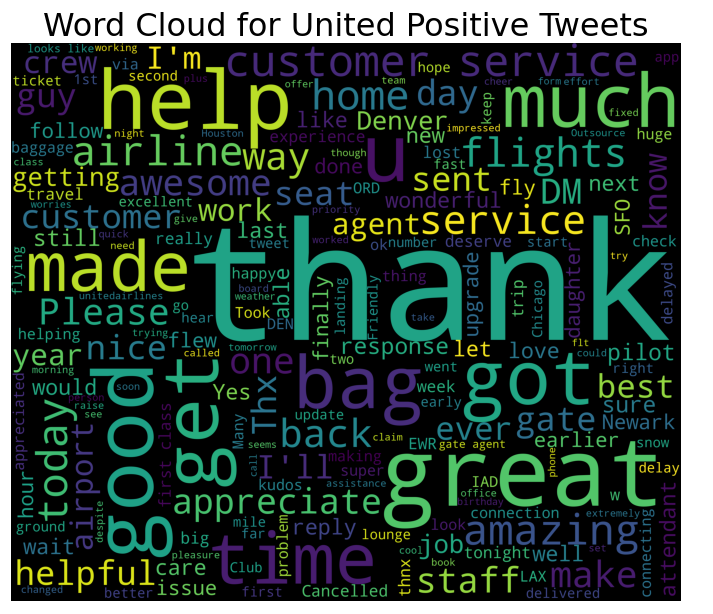
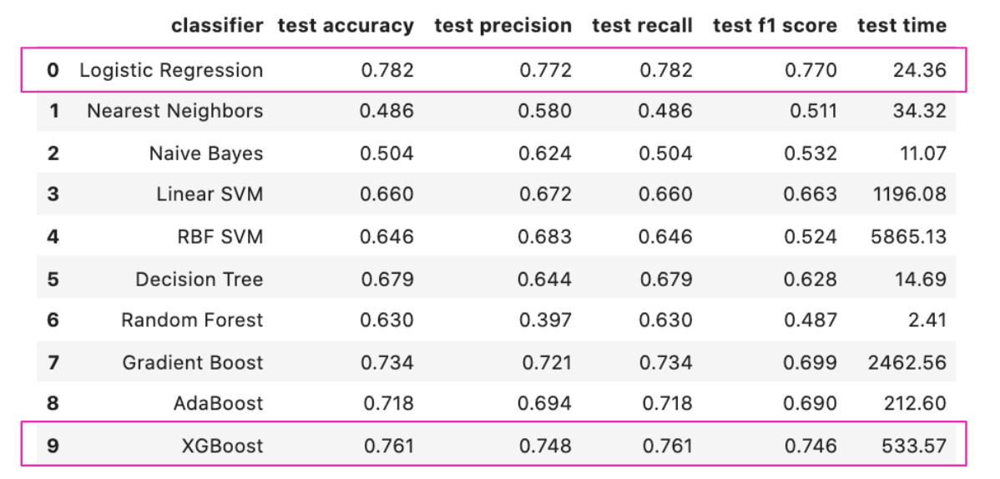

# United Airlines Twitter Sentiment Analysis

## Objective

The purpose of this analysis was to classify tweets related to 6 different airline carriers as either negative, neutral or positive. By taking a look at the feature importances that emerged through modeling and by looking at vocabulary used in each type of tweet classification, we composed a SWOT analysis for United Airlines and made recommendations for future action. 

## Dataset
The dataset for this analysis was obtained from Kaggle. It features tweets from February of 2015, and consists of ~14k records.

## Initial Exploration
Initial data exploration revealed common themes across tweet classifications. For example, the most highly prevalent negative sentiment was "customer service" but as this was consistent across airlines it didn't prove to be a problem that was unique to United Airlines. However, as "customer service" is clearly a problem industry wide, retraining and using resources to improve customer service might be a way to set United ahead of competitors.

## NLP Modeling
Using the TfidfVectorizer and optimizing our models for recall, we then began to explore a variety of classification models to see how well they could perfom. The highest performers were Logistic Regression, XGBoost and Naive Bayes models. Base model results are as follows:

After some parameter tuning, we were able to optimize a Naive Bayes to have both a precision and recall measure at 74-75%.

